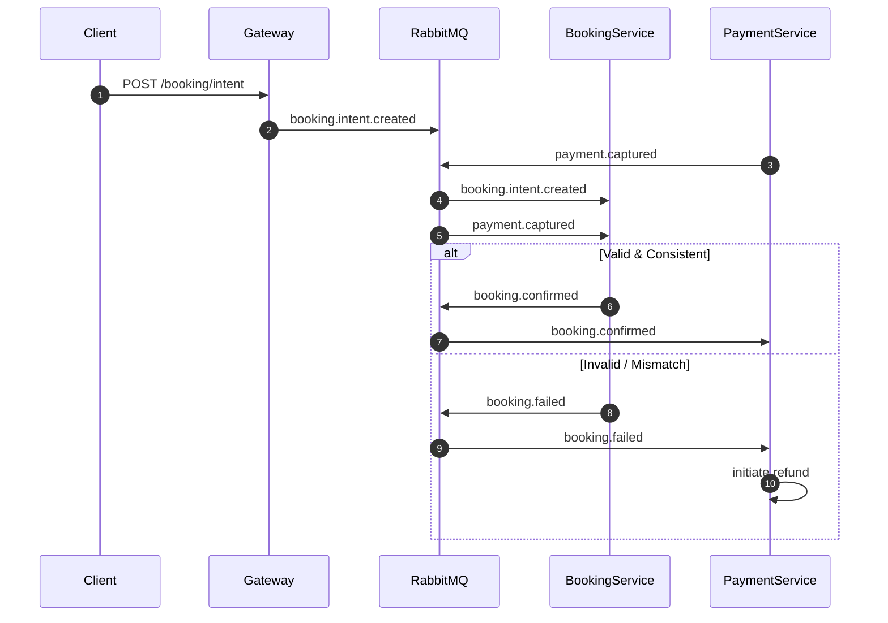
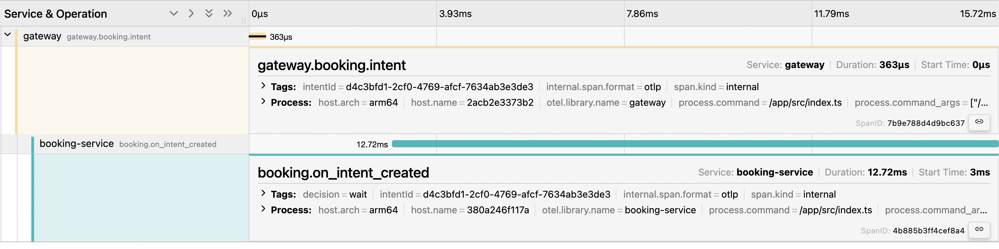
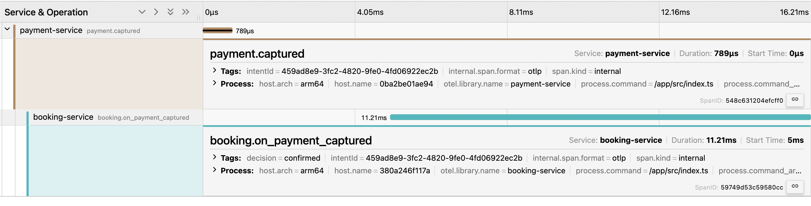
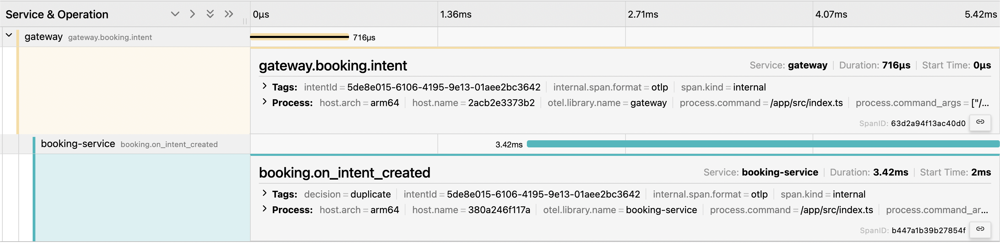
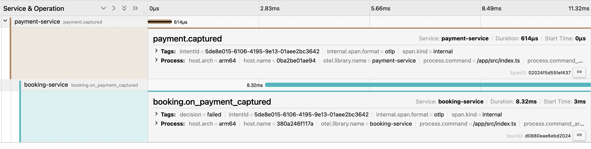

# Event-Driven Booking System (Saga-Based)

## Overview

This project is a **production-inspired event-driven booking system** designed to guarantee correctness under partial failures, message duplication, and out-of-order event delivery.

It demonstrates how to safely handle **payments + bookings** using:
- Event-driven architecture
- Saga-style coordination
- Idempotent consumers
- Automatic compensation (refund triggers)
- End-to-end distributed tracing with OpenTelemetry

The system converges to a correct final state **even when services crash or events arrive in the wrong order**.

---

## Backstory (Why This Project Exists)

While working on a home services startup, I encountered production issues where:

- Payments were successfully captured
- Booking creation failed due to service crashes or API errors
- Users were charged but left without a booking
- Manual refunds were required
- This resulted in poor user experience and bad app store reviews

This project was built to explore a **robust backend design** where:
- Failures are expected, not exceptional
- No single service owns the entire flow
- The system self-heals through events
- Money is never “lost” even if services go down

> NOTE: Time-based refunds are typically handled via reconciliation jobs in production.  
> This project focuses on **event-driven correctness and convergence**.

---

## High-Level Architecture

**Services**
- Gateway (HTTP entry point)
- Booking Service (booking intent state machine)
- Payment Service (payment capture & refunds)
- RabbitMQ (event broker)
- MongoDB (per-service persistence)
- OpenTelemetry & Jaeger (distributed tracing)

**Communication Model**
- Client → Gateway (HTTP)
- Service → Service (Events only)

There are **no synchronous service-to-service calls**.

---

## Core Business Flow (Saga)

### Trivial Path

1. Client calls `POST /booking/intent`
2. Gateway emits `booking.intent.created`
3. Booking Service stores intent as `pending`
4. Payment Service emits `payment.captured`
5. Booking Service validates and confirms booking
6. Booking Service emits `booking.confirmed`

---

## Architecture Diagram



---

### Out-of-Order Event Handling

If **payment arrives before booking intent**:

1. `payment.captured` arrives first
2. Booking Service stores intent as `payment_received_first`
3. Later `booking.intent.created` arrives
4. Booking Service reconciles state
5. Booking is confirmed correctly

---

### Failure & Compensation

If any validation fails (e.g. amount mismatch):

- Booking is marked `failed`
- `booking.failed` event is emitted
- Payment Service initiates refund

This ensures:
- No free bookings
- No lost money
- Eventual correctness

---

## Correctness Guarantees

The system guarantees:

- At-least-once delivery handling
- Idempotent consumers
- Safe retries
- No double booking
- No payment without final resolution
- Eventual consistency

Even if:
- Booking service is down
- Events are duplicated
- Events arrive out of order

## Observability (Distributed Tracing)

The system is fully instrumented using **OpenTelemetry**.

Each business flow produces a **single distributed trace** spanning:
- Gateway
- Payment Service
- Booking Service
- RabbitMQ event boundaries

### What Is Traced

- HTTP requests
- Event publish
- Event consume
- Business decisions (`wait`, `confirm`, `fail`, `noop`, `duplicate`)
- Error paths

Below are real distributed traces captured using OpenTelemetry and Jaeger, showing
end-to-end request and event flow across services.

### Booking Intent → Booking Service



---

### Payment Captured → Booking Confirmation



---

### Duplicate / Out-of-Order Event Handling



---

### Failure Handling (Booking Failed)




---

## Failure Scenarios Tested

Automated scripts simulate:

- Trivial path
- Payment arrives before booking intent
- Amount mismatch
- Duplicate events
- Booking service crash and recovery

Each test validates:
- Final booking state
- Emitted events
- Correct compensation behavior

---

## How to Run

Start the system:

```bash
docker compose up
cd scripts
bun run trivial
bun run payment-first
bun run amount-mismatch
bun run duplicate-events
```

For Booking service crash and recovery
```bash
docker compose up
chmod +x scripts/src/test-booking-service-down.sh
./scripts/src/test-booking-service-down.sh
```

Jaeger UI
open http://localhost:16686

---